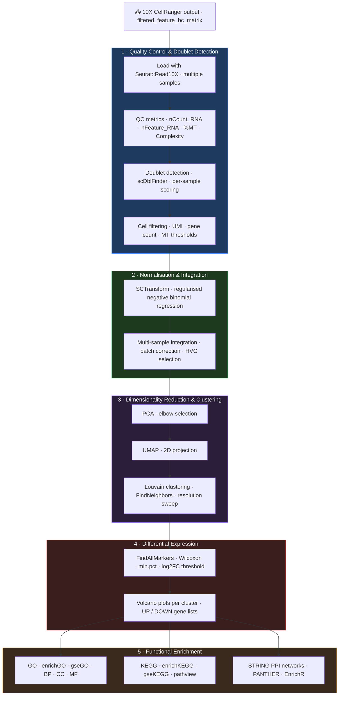

# snRNA-seq Analysis Pipeline

[](https://www.r-project.org/)
[](https://satijalab.org/seurat/)
[](https://bioconductor.org/)
[](https://rstudio.github.io/renv/)
[](#license)

> Modular R pipeline for single-nucleus RNA-seq analysis: from 10X CellRanger output through quality control, SCTransform normalisation, clustering, differential expression, and multi-layered functional enrichment.

## Overview

End-to-end snRNA-seq pipeline built on Seurat v5. Designed for multi-sample experiments (WT vs KO), the pipeline covers every analytical stage from raw CellRanger output to publication-ready figures and pathway enrichment reports. Each stage is implemented as an independent modular script callable from RMarkdown notebooks, enabling rapid adaptation to new datasets without pipeline modification.

---

## Pipeline Architecture



---

## Repository Structure

```
.
├── README.md
├── renv.lock                          # Dependency lock file (R 4.5.2)
├── single_cell.Rproj                  # RStudio project
│
├── code/                              # Modular R scripts
│   ├── 00_packages.R                  # Dependency management (pak)
│   ├── 01_sc_functions.R              # Core QC utilities & plot export
│   ├── 02_vulcano_plots.R             # Volcano plot generation
│   ├── 03_GO.R                        # GO over-representation analysis
│   ├── 04_strings.R                   # STRING PPI network analysis
│   ├── 05_gse.R                       # GSEA (GO + KEGG ranked lists)
│   ├── 06_Heatmap.R                   # ComplexHeatmap visualisation
│   ├── 07_HeatMap_GO_types.R          # GO-category heatmaps
│   ├── 08_EnrichR.R                   # EnrichR enrichment
│   ├── 09_gseKEGG.R                   # KEGG pathway GSEA + pathview
│   ├── ABA_sc_ref.R                   # Allen Brain Atlas reference
│   ├── Clusters_splitted_libraries.R  # Per-library independent clustering
│   ├── Doublets_Finders.R             # scDblFinder doublet detection
│   └── global_variables.R             # Thresholds & organism parameters
│
└── rmds/                              # R Markdown analysis notebooks
    ├── Single_Cell_10X_Integrated_functions_SCT - UBC_Cre.Rmd
    ├── Single_Cell_10X_Integrated_functions_SCT - PV_Cre.Rmd
    ├── Clustering Association_FindAllMarkers.Rmd
    └── ...
```

---

## R Scripts Reference

| Script | Purpose |
|---|---|
| `00_packages.R` | Install/load all dependencies via `pak` |
| `01_sc_functions.R` | `library_summary()`, `generate_qc_plots()`, `save_plot()` — QC metrics and dual-format (TIFF + PDF) export |
| `02_vulcano_plots.R` | `perform_vulcano()` — ggplot2 volcano plots with ggrepel labels per cluster |
| `03_GO.R` | `perform_enrichGO()` — clusterProfiler GO over-representation (BP, CC, MF) |
| `04_strings.R` | STRINGdb PPI network retrieval and visualisation |
| `05_gse.R` | `process_gene_list()` — GSEA ranked-list pipeline (GO + KEGG) |
| `06_Heatmap.R` | ComplexHeatmap of top DEGs per cluster |
| `07_HeatMap_GO_types.R` | GO-category-specific expression heatmaps |
| `08_EnrichR.R` | Multi-library enrichment via enrichR (GO, KEGG, Reactome, WikiPathways) |
| `09_gseKEGG.R` | `gseKEGG()` with pathview pathway diagrams |
| `Doublets_Finders.R` | scDblFinder per-sample doublet scoring and removal |
| `Clusters_splitted_libraries.R` | Independent per-sample UMAP + Louvain clustering |
| `ABA_sc_ref.R` | Allen Brain Atlas integration for cell type reference annotation |
| `global_variables.R` | Centralised thresholds: `p_val`, `FC`, `kegg_organism`, `species` |

### Configuration (`global_variables.R`)

```r
p_val          <- 0.05          # Adjusted p-value threshold
FC             <- 0.25          # log2FC threshold
kegg_organism  <- "mmu"         # KEGG organism code (configurable)
species        <- 10090         # NCBI taxonomy ID
organism       <- "org.Mm.eg.db"
keyType        <- "UNIPROT"
```

---

## Reproducing the Analysis

### 1. Restore the R environment

```r
install.packages("renv")
renv::restore()   # Restores all packages from renv.lock (R 4.5.2)
```

### 2. Run the pipeline

Open the appropriate RMarkdown notebook and set `data_path` to your CellRanger output directory:

```r
# Main analysis
rmarkdown::render("rmds/Single_Cell_10X_Integrated_functions_SCT - UBC_Cre.Rmd")
```

### 3. Run enrichment modules independently

```r
source("code/03_GO.R")       # GO over-representation
source("code/05_gse.R")      # GSEA
source("code/09_gseKEGG.R")  # KEGG pathway analysis
source("code/04_strings.R")  # STRING PPI networks
```

> Raw 10X CellRanger data and processed Seurat objects are not versioned. The `renv.lock` file fully specifies the computational environment.

---

## Tech Stack

| Layer | Tools |
|---|---|
| Single-cell framework | Seurat v5, sctransform |
| Doublet detection | scDblFinder |
| Cell type annotation | SingleR, Azimuth, Allen Brain Atlas |
| Differential expression | FindAllMarkers (Wilcoxon), MAST |
| GO enrichment | clusterProfiler (enrichGO, gseGO) |
| KEGG analysis | clusterProfiler (enrichKEGG, gseKEGG), pathview |
| PPI networks | STRINGdb |
| Multi-database enrichment | enrichR |
| Pathway classification | rbioapi (PANTHER) |
| Visualisation | ggplot2, ComplexHeatmap, patchwork |
| Annotation | org.Mm.eg.db, biomaRt, AnnotationHub |
| Reproducibility | renv |

---

## Author

**Santiago López Begines, PhD**
Neuroscientist → Data Scientist
[Portfolio](https://slopezbegines.github.io/projects/single-cell/) · [GitHub](https://github.com/SLopezBegines) · [LinkedIn](https://linkedin.com/in/santibegines) · [ORCID](https://orcid.org/0000-0001-8809-8919)

---

## License

Code available for educational and research purposes with attribution. Raw sequencing data and processed results are not included.
